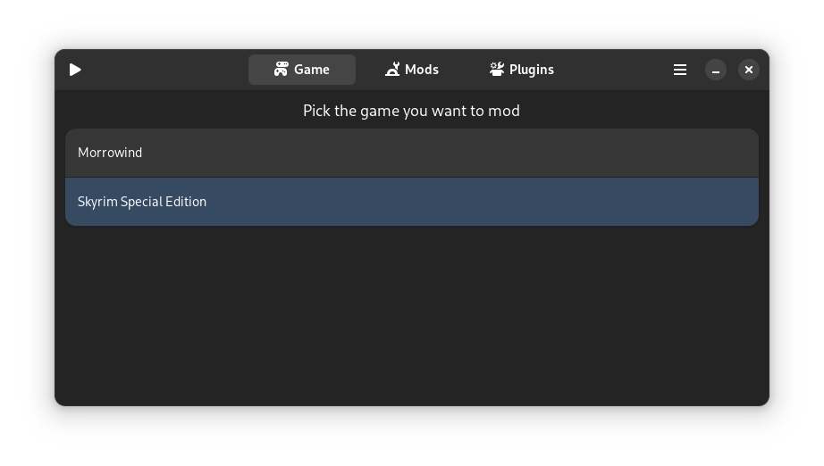
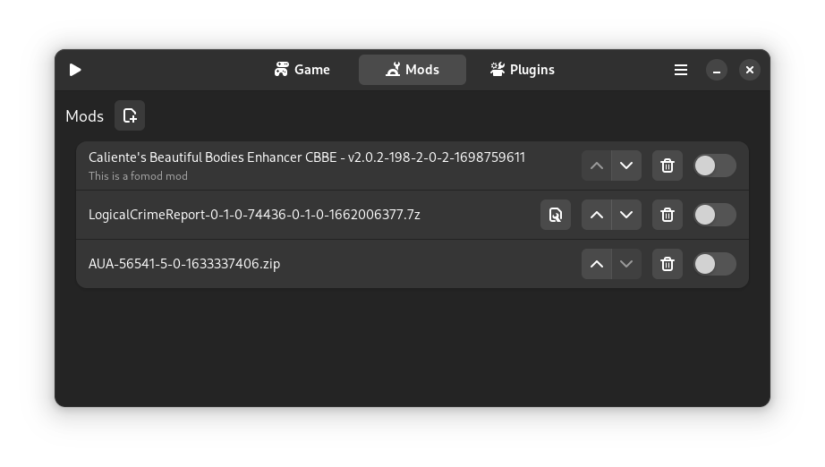
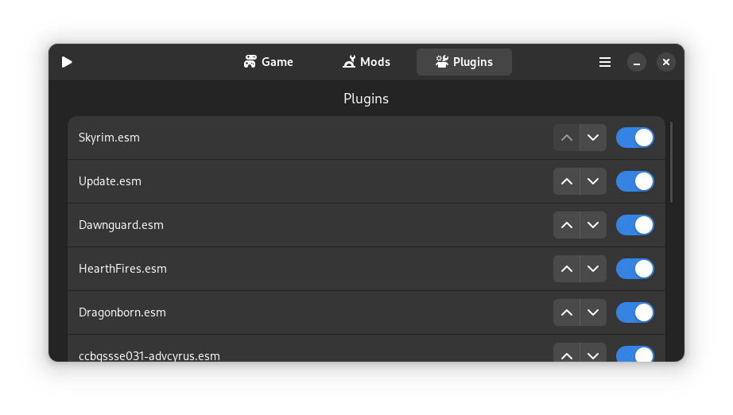

# A work in progress Bethesda game mod manager for Linux

The current version si not usable, the previous cli based version is still available from the release page.

This mod manager is made to protect the original game files files at all costs.
if an operation or a mod tries to modify the files they will be stocked in and overlay folder (~/.local/share/modmanager/UPPER_DIRS/appid)

mods conflicts are solved by priority like in mo3

## Screenshots





## Requirements:
* gtk4
* glib2
* 7z unzip unrar (used for each respective formats)
* libaudit
* Fuse 3
* Fuse-overlayfs

## TODO:
1. Find a name
2. Support more games
3. adding a hook for %command% in steam

## How to contribute:
if you have creation engine based games not listed in src/steam.h
please open an issue with the name of the game folder in steamapps/common/

otherwise don't hesitate to open an issue and suggest changes. if you event know how to code in C don't be scared to create merge request.

## Note on the licence
i chose gpl2 as the only thing i want is that if i give you code you give me your changes back.

## Compilation and install instructions:
download a version from the releases.

then run this inside the folder:
```bash
meson builddir
cd builddir
ninja
```
